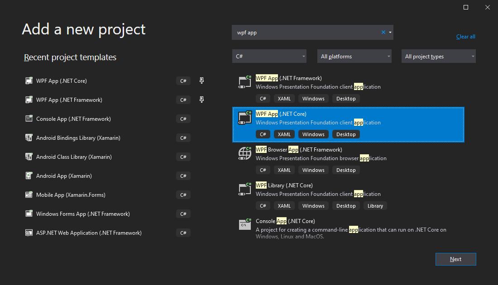
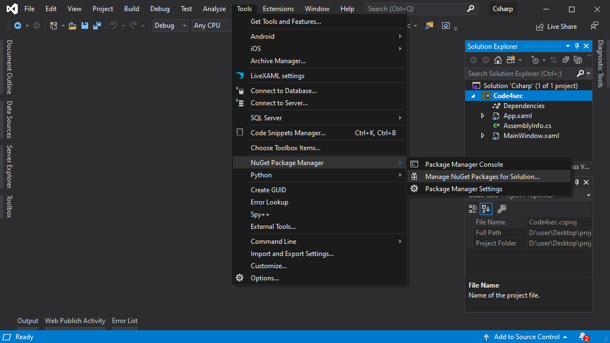
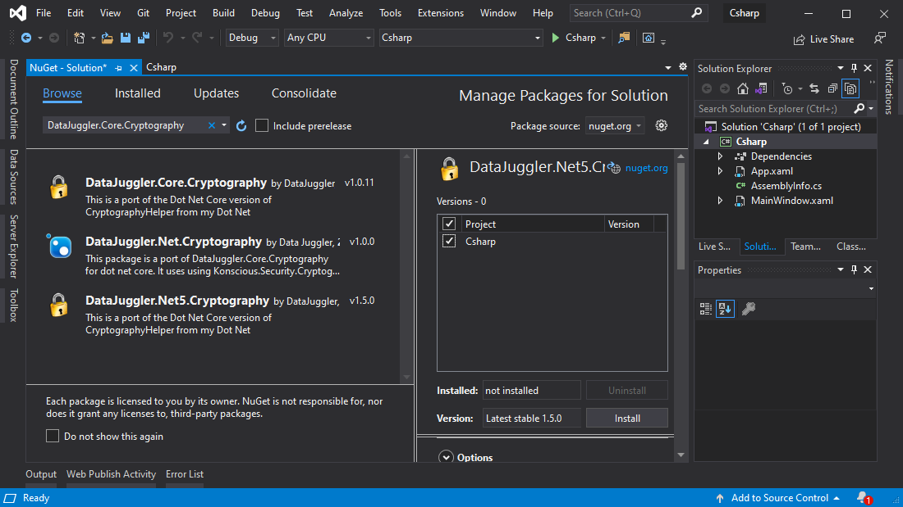
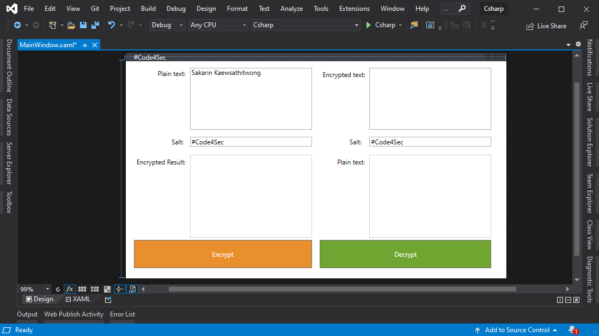
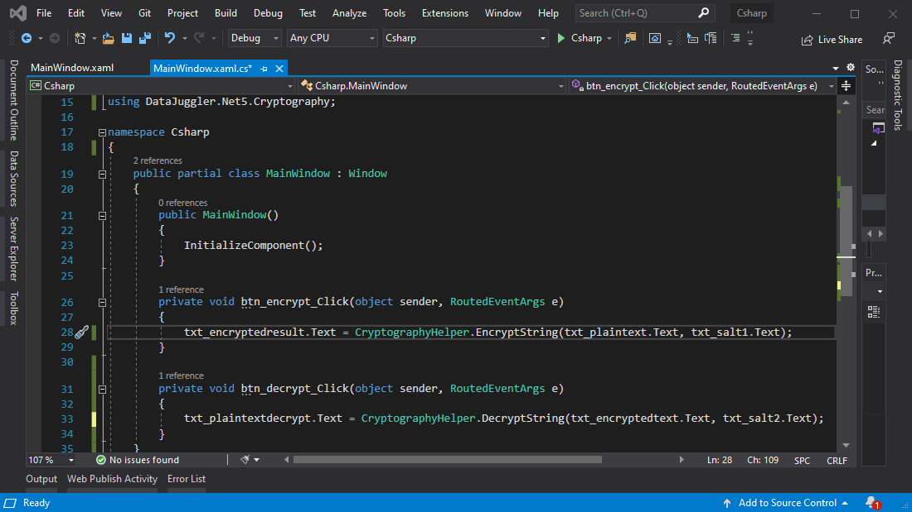
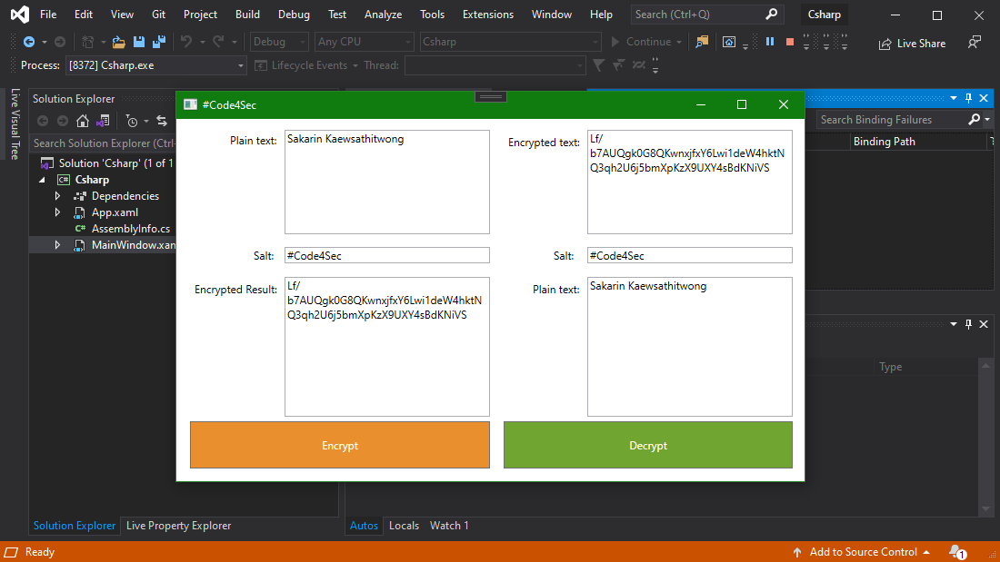
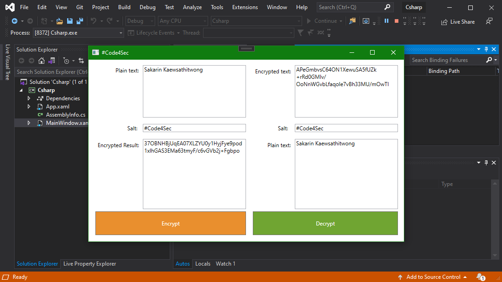

# เข้ารหัสและถอดรหัสด้วย CryptographyHelper.EncryptString() ในภาษา C#

### เมธอด CryptographyHelper.EncryptString() นี้เป็นเมธอดสำหรับการ **Encrypt** โดยพัฒนาด้วยภาษา **C#**
<br>


<br>
<br>
ในที่นี้เราจะทดสอบโดยการใช้ ภาษา C# .NET 5.0

1. ขั้นแรกทำการสร้าง **Project** ขึ้นมาโดยเลือก **WPF APP .NET Core**

1. เมื่อสร้าง Project เสร็จให้เราติดตั้ง Package สำหรับการเรียกใช้ Library โดยเข้าเมนู **Tool** &#8594; **NuGet Package Manager** &#8594; **Manage NuGet Packages for Solution...**

1. ค้นหา **Package** ชื่อว่า **DataJuggler.Core.Cryptography** และติดตั้ง

1. จากนั้นสร้าง **Textbox** สำหรับการทดสอบโดยจากตัวอย่างจะทำการ **Encrypt** และ **Decrypt** โดยใส่ **Salt** เข้าไปด้วย (Salt ควรเป็นค่าสุ่มเพื่อป้องกันการ Crack ข้อความ อ่านเพิ่มเติมได้ **[ที่นี่...](https://inuax.github.io/code4sec/python_crypt_mksalt))**

1. เพิ่มการเรียกใช้ **Package** และ เขียนโค้ดใน **Event** ของ **Button** ทั้งสองปุ่ม
    ```csharp
    using DataJuggler.Net5.Cryptography;
    ```

    ```csharp
    private void btn_encrypt_Click(object sender, RoutedEventArgs e)
    {
        txt_encryptedresult.Text = CryptographyHelper.EncryptString(txt_plaintext.Text, txt_salt1.Text);
    }

    private void btn_decrypt_Click(object sender, RoutedEventArgs e)
    {
        txt_plaintextdecrypt.Text = CryptographyHelper.DecryptString(txt_encryptedtext.Text, txt_salt2.Text);
    }
    ```
    
1. **Run program** และทดสอบการทำงานโดยใส่ **Plain text** และ **Salt**

1. ซึ่งการ **Encrypt** โดยใช้ **Plain text** เดิม **Salt** เดิม ในแต่ละครั้งจะให้ **Encrypted Result** ที่แตกต่างกัน


### Method **EncryptString** ใช้สำหรับการ **Encrypt**
### Method **DecryptString** ใช้สำหรับการ **Decrypt**

#### Knowledge base อื่นๆ ที่น่าสนใจ
* **[ซ่อนภาพที่คุณไม่อยากให้ใครเห็นง่ายๆ ด้วยภาษา Python](../Python/)**
* **[ข้ารหัสและถอดรหัสด้วย CryptographyHelper.EncryptString() ในภาษา C#](../Csharp/)**
* **[ป้องกันรหัสผ่านรั่วไหลบน MySQL ด้วย Function PASSWORD](../MySQL/)**
* **[Function sha1 บน Node.JS](../JavaScript/)**
* **[วิธีการ Hash บนภาษา Java ด้วย อัลกอริทึม SHA-256](../Java/)**
<br>
<br>
<br>

created by Sakarin Kaewsathitwong