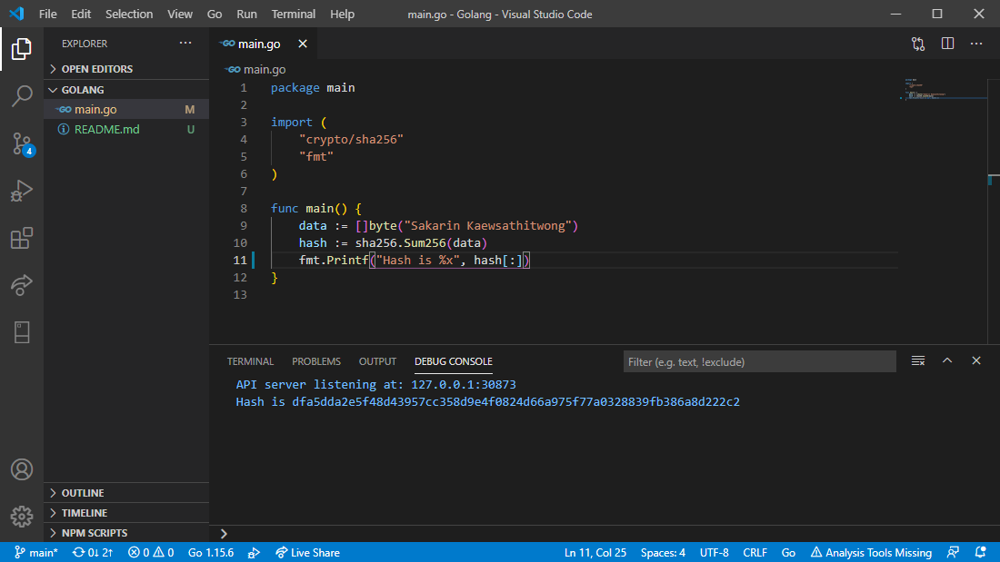

# วิธีการ Hash บนภาษา Golang ด้วย อัลกอริทึม SHA-256

### **Hash** เป็น **One-way function** ซึ่งไม่สามารถทำให้กลับมาเป็นข้อมูลเดิมได้ เว้นแต่มีการเก็บข้อมูลเป็น Dictionary มากพอซึ่งใน Dictionary จะประกอบไปด้วย **ข้อความ** และค่า **Hash** ซึ่งจะเอาค่า **Hash** มาเทียบเพื่อหาข้อความ แต่อย่าลืมไปข้อความ 2 ข้อความที่ทำการ Hash อาจจะได้ค่าเดียวกันก็เป็นได้ ซึ่งการใช้ Function **sha256** ก็คือการ **Hash** เช่นกัน
<br>

 
<br>
<br>

การที่จะป้องข้อมูลบางอย่างหลุดออกไปนั้นทำได้หลากหลายวิธี ถึงแม้ว่าข้อมูลจะหลุดออกไปแต่ก็ไม่สามารถนำไปใช้งานได้หรือไม่สามารถเห็นข้อมูลจริงๆ ได้ หนึ่งในวิธีนั้นก็หนีไม่พ้น Hash Function ซึ่งการ Hash ก็มีอัลกอริทึมในการทำที่แตกต่างกันไปไม่ว่าจะเป็น **md5**, **sha1**, **sha256**

### เริ่มกันเลย

```go
package main

import (
    "crypto/sha256"
    "fmt"
)

func main() {
    data := []byte("Sakarin Kaewsathitwong")
    hash := sha256.Sum256(data)
    fmt.Printf("Hash is %x", hash[:])
}
```
ผลลัพธ์ที่ได้
```
Hash is dfa5dda2e5f48d43957cc358d9e4f0824d66a975f77a0328839fb386a8d222c2
```

<br>
<br>

### แล้วทำไมต้อง hash ข้อมูลให้มันยุ่งยาก ?
ก็เพื่อป้องกันไม่ให้ทำการ de-hash ข้อมูลเดิมกลับมาได้นั้นเองเพราะ Hash เป็น One-way function มีทางเดียวที่อยากจะรู้ข้อมูลข้างในก็คือการ Brute-force ซึ่งการทำแบบนั้นก็อาจจะไม่ใช่คำตอบที่ถูกต้องก็ได้

#### Knowledge base อื่นๆ ที่น่าสนใจ
* **[ซ่อนภาพที่คุณไม่อยากให้ใครเห็นง่ายๆ ด้วยภาษา Python](../Python/)**
* **[ข้ารหัสและถอดรหัสด้วย CryptographyHelper.EncryptString() ในภาษา C#](../Csharp/)**
* **[ป้องกันรหัสผ่านรั่วไหลบน MySQL ด้วย Function PASSWORD](../MySQL/)**
* **[Function sha1 บน Node.JS](../JavaScript/)**
* **[วิธีการ Hash บนภาษา Java ด้วย อัลกอริทึม SHA-256](../Java/)**
* **[วิธีการ Hash บนภาษา Golang ด้วย อัลกอริทึม SHA-256](../Golang/)**
* **[Function empty คืออะไรในภาษา PHP](../PHP/)**
<br>
<br>

created by Sakarin Kaewsathitwong