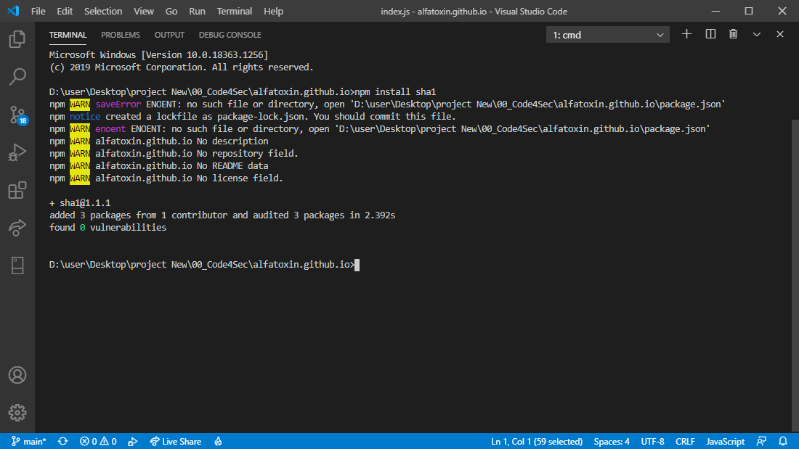
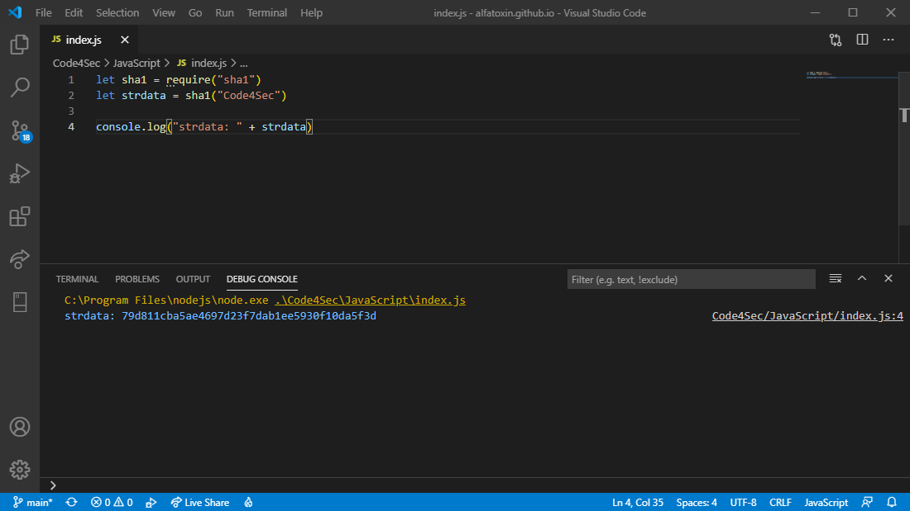

# Function sha1 บน Node.JS 

### **Hash** เป็น **One-way function** ซึ่งไม่สามารถทำการถอดรหัสกลับมาเป็นข้อมูลเดิมได้ เว้นแต่มีการเก็บข้อมูลเป็น Dictionary มากพอซึ่งใน Dictionary จะประกอบไปด้วย **ข้อความ** และค่า **Hash** ซึ่งจะเอาค่า **Hash** มาเทียบเพื่อหาข้อความ แต่อย่าลืมไปข้อความ 2 ข้อความที่ทำการ Hash อาจจะได้ค่าเดียวกันก็เป็นได้ ซึ่งการใช้ Function **sha1** ก็คือการ **Hash** เช่นกัน
<br>


<br>
<br>

การที่จะป้องข้อมูลบางอย่างหลุดออกไปนั้นทำได้หลากหลาย หลุดออกไปแต่ไม่สามารถนำไปใช้งานได้หรือไม่สามารถเห็นข้อมูลจริงๆ ได้ วิธีหนึ่งในนั้นก็หนีไม่พ้น Hash Function สิ่งการ Hash ก็มีอัลกอริทึมในการทำที่แตกต่างกันไปไม่ว่าจะเป็น **md5**, **sha1**, **sha256**

### เริ่มกันเลย
1. ก่อนอื่นต้องติดตั้ง Package เสียก่อน
    ```shell
    > npm install sha1
    ```
    
1. เมื่อติดตั้งเสร็จก็เริ่มทดสอบด้วยการเรียกใช้ sha(1)
    ```js
    let sha1 = require("sha1")
    let strdata = sha1("Code4Sec")

    console.log("strdata: " + strdata)
    ```
    ผลลัพธ์ที่ได้
    ```
    strdata: 79d811cba5ae4697d23f7dab1ee5930f10da5f3d
    ```
    
<br>
<br>

### แล้วทำไมต้อง hash ข้อมูลให้มันยุ่งยาก ?
ก็เพื่อป้องกันไม่ให้ทำการ de-hash ข้อมูลเดิมกลับมาได้นั้นเองเพราะ Hash เป็น One-way function มีทางเดียวที่อยากจะรู้ข้อมูลข้างในก็คือการ Brute-force ซึ่งการทำแบบนั้นก็อาจจะไม่ใช่คำตอบที่ถูกต้องก็ได้

<br>
<br>
created by Sakarin Kaewsathitwong