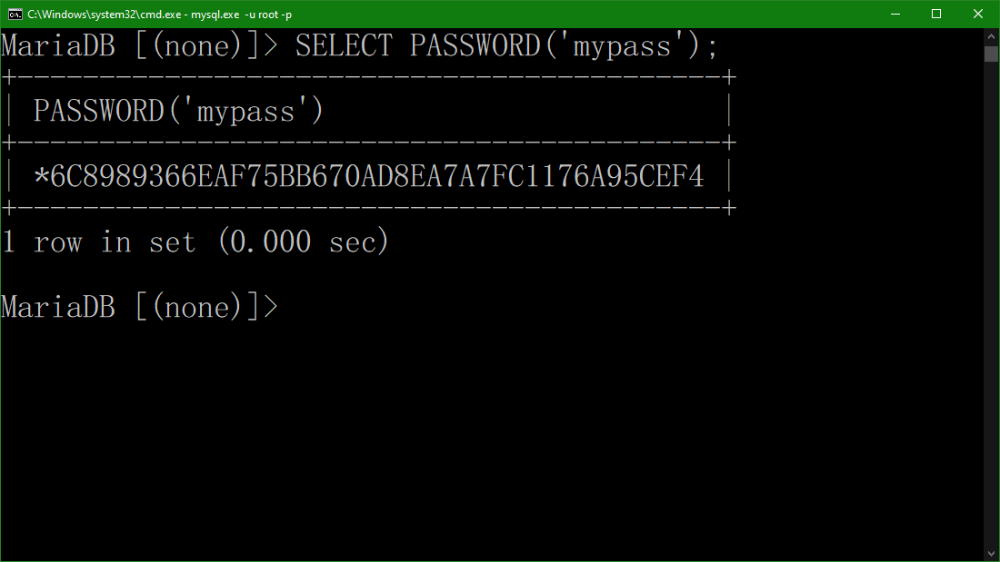

# ป้องกันรหัสผ่านรั่วไหลบน MySQL ด้วย Function PASSWORD

### **Hash** เป็น **One-way function** ซึ่งไม่สามารถทำให้กลับมาเป็นข้อมูลเดิมได้ เว้นแต่มีการเก็บข้อมูลเป็น Dictionary มากพอซึ่งใน Dictionary จะประกอบไปด้วย **ข้อความ** และค่า **Hash** ซึ่งจะเอาค่า **Hash** มาเทียบเพื่อหาข้อความ แต่อย่าลืมไปข้อความ 2 ข้อความที่ทำการ Hash อาจจะได้ค่าเดียวกันก็เป็นได้ ซึ่งการใช้ Function **PASSWORD** บน **MySQL** จะใช้การ **Hash** เช่นกัน
<br>


<br>
<br>

การที่จะป้องกันรหัสผ่านบน **Database** หลุดออกไปนั้นทำได้หลากหลายวิธีหนึ่งในนั้นก็หนีไม่พ้น Hash Function ซึ่งการ Hash ก็มีอัลกอริทึมในการทำที่แตกต่างกันไปไม่ว่าจะเป็น **md5**, **sha1**, **sha256** หรือเป็น **PASSWORD()** บน **MySQL** ก็ตาม

### เริ่มกันเลย ~~~~ 
1. เปิด **MySQL** หรือ **MariaDB** ขึ้นมา
1. ทดลองด้วยคำสั่ง
    ```sql
    SELECT PASSWORD('mypass');
    ```
    ผลลัพธ์ที่ได้
    ```sql
    +-------------------------------------------+
    | PASSWORD('mypass')                        |
    +-------------------------------------------+
    | *6C8989366EAF75BB670AD8EA7A7FC1176A95CEF4 |
    +-------------------------------------------+
    ```
    
<br>
<br>

เราสามารถนำไปประยุกต์ใช้กับการ **INSERT** ข้อมูลได้ตัวอย่างเช่น
```sql
INSERT INTO tableuser (tbu_username, tbu_password) VALUES ('user1', PASSWORD('password'));
```
หรือจะเป็นการ **Query** เช่น
```sql
SELECT * FROM tableuser WHERE tbu_username = 'user1' AND tbu_password = PASSWORD('password');
```

### หลายๆ คนคงจะตั้งคำถามว่าการ Hash ด้วย Function PASSWORD นั้นมันดีที่สุดหรือไม่ก็ตอบในที่นี้ได้เลยว่า มันไม่ใช่วิธีการที่ดีที่สุดแต่อย่างน้อยการ Hash ก็จะช่วยปิดบังให้คนที่ประสงค์ต่อข้อมูลทำงานได้ยากมากขึ้น เพราะอะไรรู้ไหมครับ ก็เพราะว่าทำยังไงก็หนีไม่พ้นการ Brute force อยู่ดี

#### Knowledge base อื่นๆ ที่น่าสนใจ
* **[ซ่อนภาพที่คุณไม่อยากให้ใครเห็นง่ายๆ ด้วยภาษา Python](../Python/)**
* **[ข้ารหัสและถอดรหัสด้วย CryptographyHelper.EncryptString() ในภาษา C#](../Csharp/)**
* **[ป้องกันรหัสผ่านรั่วไหลบน MySQL ด้วย Function PASSWORD](../MySQL/)**
* **[Function sha1 บน Node.JS](../JavaScript/)**
* **[วิธีการ Hash บนภาษา Java ด้วย อัลกอริทึม SHA-256](../Java/)**
<br>
<br>

created by Sakarin Kaewsathitwong