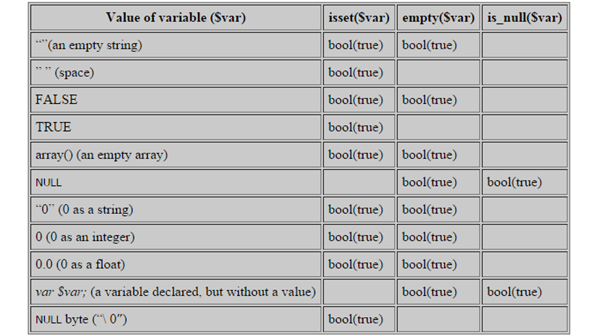

# Function empty คืออะไรในภาษา PHP

### เราจะทำการเปรียบเทียบระหว่าง empty(), isset() และ isnull() มีความแตกต่างกันอย่างไร
<br>

 
<br>
<br>

### เริ่มทดสอบจาก Function ทั้ง 3 กันเลย

```php
<?php
    $var = "";
    echo "$var empty --> ";
    var_dump(empty($var));
    echo ",  isset --> ";
    var_dump(isset($var));
    echo ",  is_null --> ";
    var_dump(is_null($var));
    echo "<br><br>";

    $var = @$abc;
    echo "$var empty --> ";
    var_dump(empty($var));
    echo ",  isset --> ";
    var_dump(isset($var));
    echo ",  is_null --> ";
    var_dump(is_null($var));
    echo "<br><br>";

    $var = TRUE;
    echo "$var empty --> ";
    var_dump(empty($var));
    echo ",  isset --> ";
    var_dump(isset($var));
    echo ",  is_null --> ";
    var_dump(is_null($var));
    echo "<br><br>";
?>
```
ผลลัพธ์ที่ได้
```
empty --> bool(true) , isset --> bool(true) , is_null --> bool(false)

empty --> bool(true) , isset --> bool(false) , is_null --> bool(true)

1 empty --> bool(false) , isset --> bool(true) , is_null --> bool(false)

```

<br>

### เพื่อให้เห็นข้อมูลมากขึ้นก็ได้มีตารางเปรียบเทียบข้อมูลเพิ่มเติม


Ref. **[www.aosoft.co.th](https://www.aosoft.co.th/article/207/[PHP]-%E0%B9%80%E0%B8%9B%E0%B8%A3%E0%B8%B5%E0%B8%A2%E0%B8%9A%E0%B9%80%E0%B8%97%E0%B8%B5%E0%B8%A2%E0%B8%9A-isset-vs-empty-vs-is_null.html)**

#### Knowledge base อื่นๆ ที่น่าสนใจ
* **[ซ่อนภาพที่คุณไม่อยากให้ใครเห็นง่ายๆ ด้วยภาษา Python](../Python/)**
* **[ข้ารหัสและถอดรหัสด้วย CryptographyHelper.EncryptString() ในภาษา C#](../Csharp/)**
* **[ป้องกันรหัสผ่านรั่วไหลบน MySQL ด้วย Function PASSWORD](../MySQL/)**
* **[Function sha1 บน Node.JS](../JavaScript/)**
* **[วิธีการ Hash บนภาษา Java ด้วย อัลกอริทึม SHA-256](../Java/)**
* **[วิธีการ Hash บนภาษา Golang ด้วย อัลกอริทึม SHA-256](../Golang/)**
* **[Function empty คืออะไรในภาษา PHP](../PHP/)**
<br>
<br>

created by Sakarin Kaewsathitwong