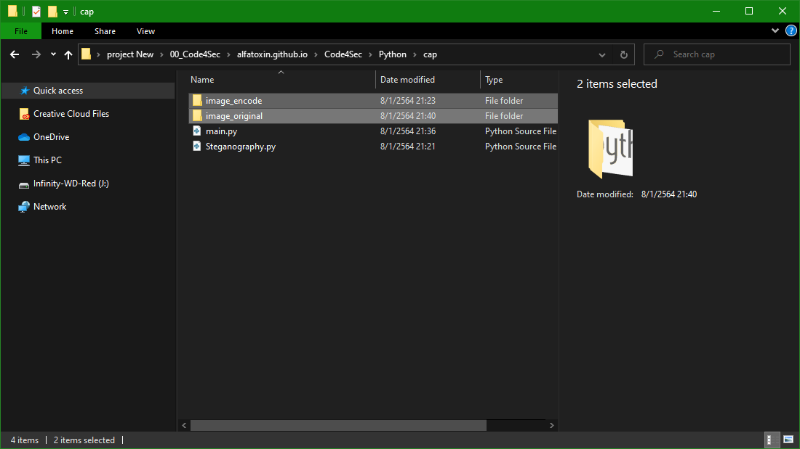
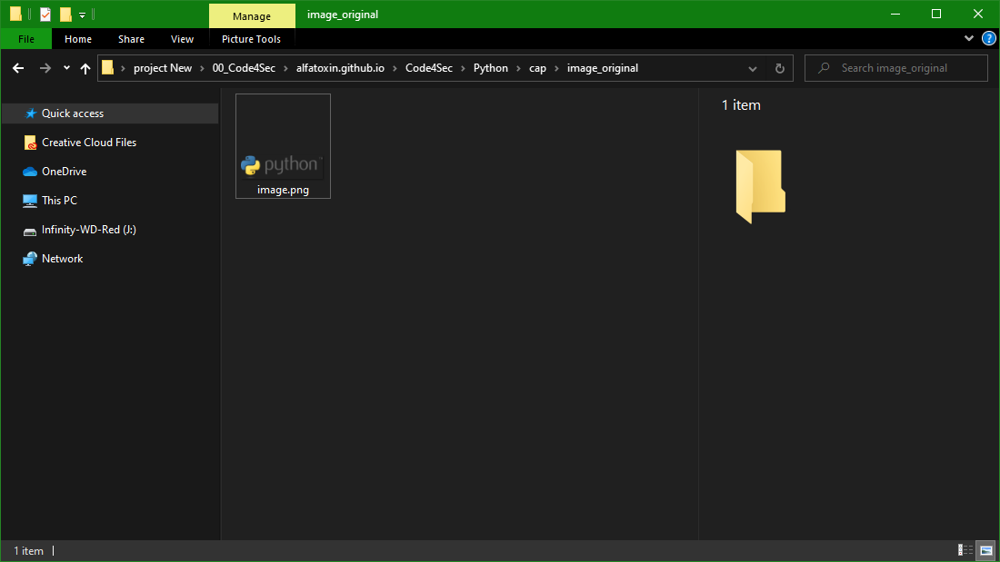
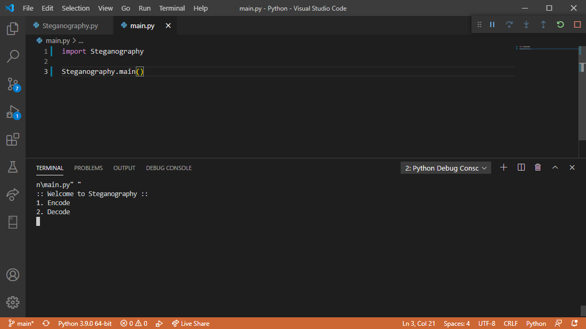
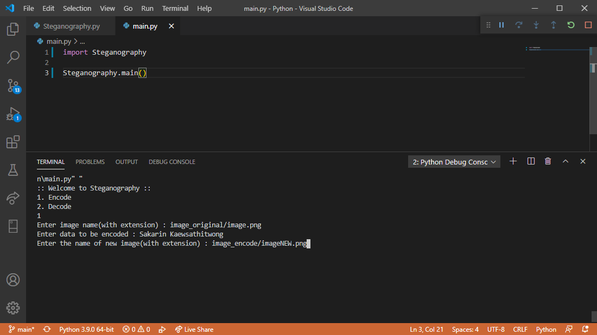
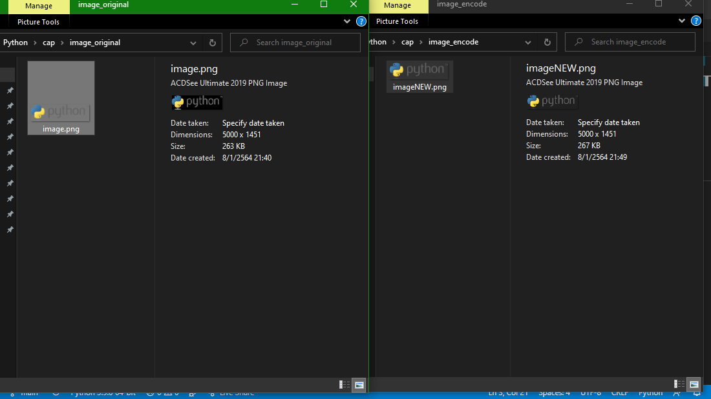
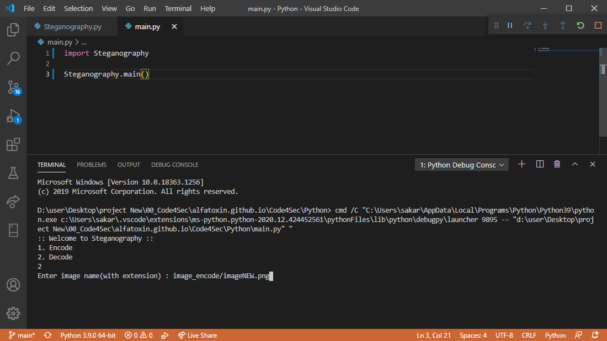
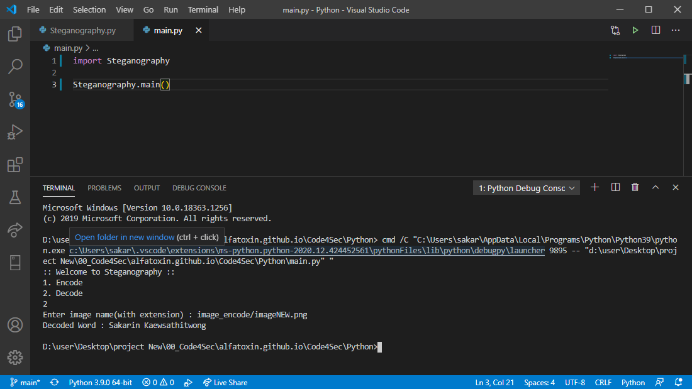
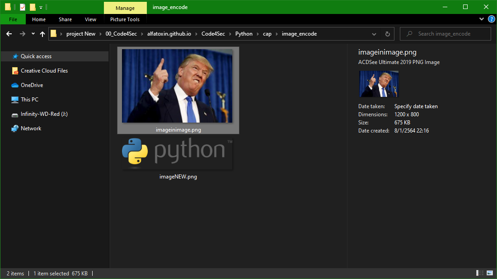
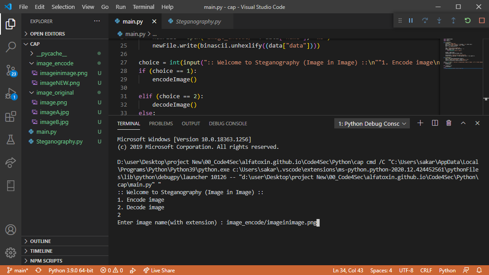
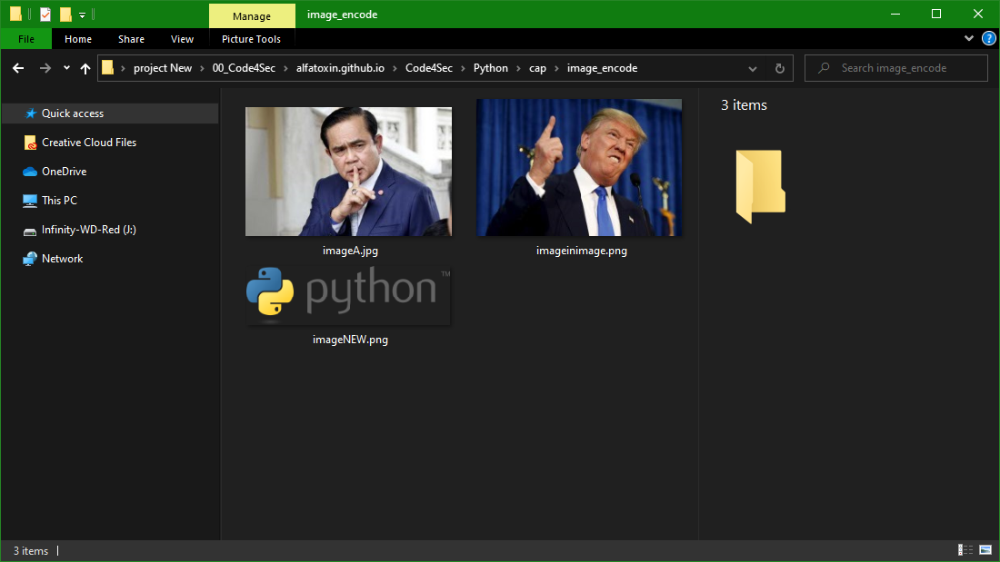

# ซ่อนภาพที่คุณไม่อยากให้ใครเห็นง่ายๆ ด้วยภาษา Python

### Steganography คือการซ่อนข้อมูลลับในสื่อทั่วๆ ไปเช่น รูป ไฟล์ หรืออะไรก็แล้วแต่ ในที่นี้เราจะทดสอบการซ่อนข้อความในรูปมาเริ่มกันเลย
<br>


<br>
<br>
โดยเราจะใช้ภาษา **Python** ทดสอบ
1. โหลดไฟล์ **[Steganography.py](/Steganography.py)**
1. ทำการติดตั้ง Library ที่ว่า **Pillow**
    ```shell
    > pip install pillow
    ```
1. สร้างไฟล์ **main.py** โดยเรียกใช้ Library **Steganography** และ function main
    ```python
    import Steganography

    Steganography.main()
    ```
1. สร้าง Folder **image_encode** และ **image_original**
    
1. เตรียมรูปที่ต้องการจะใช้สำหรับซ่อนข้อความ
    
1. ลอง Run Program จะพบเมนู 2 เมนูคือการ **Encode** และ **Decode**
    
1. เริ่มด้วยการ Encode ข้อความเข้าไปในรูปก่อน โดยระบุชื่อไฟล์ ข้อความที่ต้องการซ่อน และชื่อไฟล์ใหม่หลังจากการซ่อนข้อความ
    
1. จะพบว่าไฟล์ทั้งสองมีขนาดไม่เท่ากัน เพราะมันมีข้อความเข้าไปอยู่ในไฟล์รูปแล้วนั้นเอง !!!
    
1. ขั้นต่อมาเราจะทำการ **Decode** ข้อความออกมาโดย Run Program ใหม่ ทีนี้ให้เลือก **Decode** และระบุที่อยู่ของรูปภาพที่ถูก **Encode** ไว้
    
1. ผลลัพธ์ที่ได้จะเหมือนกับข้อความทีเราทำการ **Encode** ข้อความเข้าไป
    

## เรามาลองเล่นซ่อนรูปในรูปกันดีกว่า
1. เตรียมภาพใหม่ขึ้นมา **imageA** และ **imageB** ใน Folder **image_original** (imageA ต้องมีขนาดที่เล็กกว่า imageB)
1. ปรับโค้ดกันนิดหน่อย
    ```python
    import Steganography
    import json
    import binascii

    def encodeImage():
        filename = "imageA.jpg"
        data = open("image_original/" + filename, 'rb').read().hex()
        datalist = {"name": filename, "data": data}
        data = json.dumps(datalist)

        img = "image_original/imageB.jpg"
        image = Steganography.Image.open(img, 'r')
        if (len(data) == 0):
            raise ValueError('Data is empty')

        newimg = image.copy()
        Steganography.encode_enc(newimg, data)

        new_img_name = "image_encode/imageinimage.png"
        newimg.save(new_img_name, str(new_img_name.split(".")[1].upper()))

    def decodeImage():
        data = json.loads(Steganography.decode())
        newFile = open("image_encode/" + data["name"], "wb")
        newFile.write(binascii.unhexlify((data["data"])))

    choice = int(input(":: Welcome to Steganography (Image in Image) ::\n""1. Encode image\n2. Decode image\n"))
    if (choice == 1):
        encodeImage()

    elif (choice == 2):
        decodeImage()
    else:
        raise Exception("Enter correct input")
    ```
1. เราจะได้ภาพใหม่ 1 ภาพซึ่งในภาพนั้นยังมีอีก 1 ภาพที่มองไม่เห็น
    
1. ลดลอง **Decode** ภาพออกมาโดยการ Run Program อีกครั้งและระบุชื่อไฟล์
    
1. ผลลัพธ์ที่ได้ไม่น่าเชื่อว่าจะมี imageA อยู่ในนั้น!!
    
<br>
<br>
created by Sakarin Kaewsathitwong