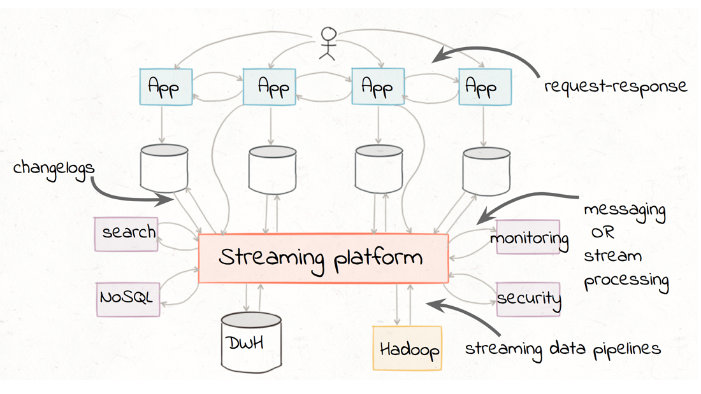

# Data Pipeline
### Data Pipeline เป็นกระบวนการในการย้ายข้อมูลจากต้นทาง ไปยังปลายทาง ซึ่งข้อมูลนั้นอาจจะมาจากหลายแหล่ง หรือจากแหล่งเดียวก็ได้
    

#### การจำแนกแหล่งข้อมูล จะแบ่งเป็น 2 ประเภทใหญ่ ๆ คือ
1. OLTP หรือ Online Transactional Processing เป็นระบบที่เก็บรวบรวม หรือสร้างข้อมูลขึ้นมา อาจเป็นข้อมูลที่มีการเคลื่อนไหวในแต่ล่ะวัน
1. OLAP หรือ Online Analytic Processing เป็นระบบที่ใช้ในเรื่องการวิเคราะห์ข้อมูล ที่มีการจัดเก็บอย่างเป็นระเบียบมาแล้ว

#### ขั้นตอนการสร้าง Data Pipeline มี 7 ขั้นตอน ดังนี้
1. Sourcing เป็นการรวบรวมแหล่ง data source ที่เกี่ยวข้อง รวมถึงต้องรู้ถึงรูปแบบการเข้าถึงข้อมูล และการดึงข้อมูลเหล่านั้น เพราะมีผลการประสิทธิภาพในการทำงานของ data pipeline 
1. Joining เป็นการนำข้อมูลมาสร้างความสัมพันธ์ด้วยเงื่อนไขที่ต้องการ
1. Extraction เป็นการปกปิดข้อมูลบางอย่างก่อนนำไปใช้ เช่น หมายเลขบัตรประชาชน
1. Standardization เป็นขั้นตอนการแปลงข้อมูลให้อยู่ในมาตรฐานเดียวกัน เพื่อที่จะนำไปใช้ได้ทันที
1. Correction เป็นการตรวจสอบ คัดแยกข้อมูลที่มีความผิดพลาด เพื่อนำมาตรวจสอบ และแก้ไขภายหลัง
1. Load เป็นการขนย้ายข้อมูลเข้าสู่ระบบ OLAP 
1. Automation เป็นขั้นตอนการออกแบบ จัดวางข้อมูล (automate workflow) รวมถึงการตรวจจับ และแก้ไขข้อผิดพลาด (error) อย่างอัตโนมัติให้ได้มากที่สุด เพื่อให้ข้อมูลมีความพร้อมเสมอ  

created by Sakarin Kaewsathitwong